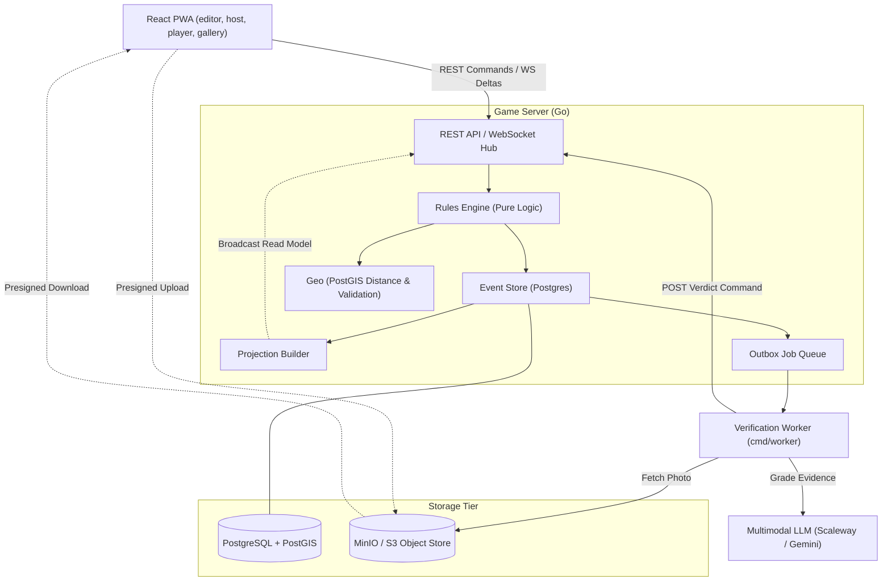

# Runway: The Game

**Runway** is a racing game played outdoors, on a board drawn over real places.
A host designs a board in the editor, publishes it, and opens a race. Teams walk
between waypoints, clear photo challenges, and race to a finish. The backend is
Go with Postgres and PostGIS. The frontend is an installable React PWA.

Read the [public documentation](https://playrunway.app/docs/) to learn more about the game, how to set it up, and how to play.


> **Alpha.** Rules, data formats, and APIs change without notice, and databases
> can be erased between releases.

> This project is an independent, fan-made game. It is not affiliated with,
> endorsed by, or associated with Jet Lag: The Game, Wendover Productions, or
> Half as Interesting.

## Architecture Overview

Runway is event sourced. Rather than keeping the current state of a race and overwriting it as play
proceeds, the server records the ordered history of everything that happened (e.g., a
team reached a waypoint, a photo was accepted, a power-up was played, ...) and works
out the present by replaying that history. 

It is built this way because a race is played outdoors, on phones with unreliable signal, by people who will sometimes
disagree about who was first. The rest of the diagram follows
from that. Requests travel in one direction, judged against the rules before
anything is allowed to become a recorded fact, while the views players look at
travel the other, rebuilt from the record and pushed out to their devices as it
grows. Anything slow, such as grading a photograph, happens off to the side and
comes back as one more fact.



## Project Structure

- **[`cmd/`](cmd/README.md)**: Executable entry points: `cmd/server` (HTTP API, WebSockets, scheduler) and `cmd/worker` (async verification worker). See [cmd/README.md](cmd/README.md).
- **[`internal/`](internal/README.md)**: Core backend packages including domain rules, event sourcing, projections, geo validation, and blob storage. See [internal/README.md](internal/README.md).
- **[`frontend/`](frontend/README.md)**: React PWA client for the board editor, game lobby, player console, and live race views. See [frontend/README.md](frontend/README.md).
- **[`docs-site/`](docs-site/)**: Public Astro/Starlight documentation site (served at `/docs/`).
- **[`DESIGN.md`](DESIGN.md)**: Specification for the "Departure" design system.
- **[`SAFETY.md`](SAFETY.md)**: Real-world safety rules for players, designers, and hosts.

## Setup with Docker Compose

1. **Configure environment:**
   ```bash
   cp .env.example .env
   ```
   Generate a secret and set `RUNWAY_WORKER_TOKEN` in `.env`:
   ```bash
   openssl rand -hex 32
   ```

2. **Start the stack:**
   ```bash
   docker compose up -d
   ```

- Frontend: `http://localhost`
- Backend API: `http://localhost:8080`
- MinIO Console: `http://localhost:9001` (API: `http://localhost:9000`)
- PostgreSQL: `localhost:5433`

## Setup for Local Development

### Prerequisites
- [Go 1.26+](https://golang.org)
- [Node.js 22+](https://nodejs.org)
- [Docker](https://www.docker.com)

### 1. Environment & Infrastructure
```bash
cp .env.example .env
# Generate and set RUNWAY_WORKER_TOKEN in .env
docker compose up -d db minio minio-init
```

### 2. Backend Server
```bash
go run cmd/server/main.go
```
Listens on `:8080` and automatically runs database migrations.

### 3. Verification Worker (Optional)
Required for automated LLM photo grading:
```bash
export RUNWAY_WORKER_TOKEN="<value-from-.env>"
export SCALEWAY_API_KEY="<your-api-key>" # or GEMINI_API_KEY
go run cmd/worker/main.go
```

### 4. Frontend
```bash
cd frontend
npm install
npm run dev
```
Accessible on `http://localhost:5173`.

## Testing

### Backend Tests
```bash
docker compose up -d db
RUNWAY_REQUIRE_DB=1 go test -count=1 ./cmd/... ./internal/...
```

### Frontend Tests & Linting
```bash
cd frontend
npm run lint
npm test
npm run build
```

### Makefile Helpers
- `make setup` — Starts containers, waits for DB health, and runs backend tests.
- `make test` — Runs Go test suite.
- `make down` — Stops containers and deletes volumes.

## Contributing

Contributions are welcome.

- [CONTRIBUTING.md](CONTRIBUTING.md): setup, the test commands, and the architectural rules that are easy to break by accident.
- [CODE_OF_CONDUCT.md](CODE_OF_CONDUCT.md): expected conduct, including the rules
  specific to a game played in public with other people's locations.
- [SAFETY.md](SAFETY.md): real-world safety guidelines for players, board
  designers, and hosts.
- [SECURITY.md](SECURITY.md): report vulnerabilities privately, never as a public
  issue.


## License

Runway is released under the [MIT License](LICENSE).

Third-party material bundled with the project is listed in
[THIRD_PARTY.md](THIRD_PARTY.md).
