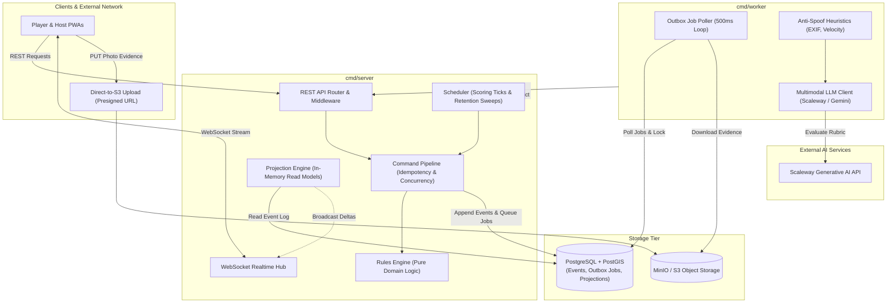

# Runway Command Entry Points

The `cmd/` directory contains the application entry points (`main` packages) that compile into executable binaries for Runway.

The backend architecture separates operational concerns into two distinct binary entry points:
1. **[`server`](server/)** (`cmd/server`) — The primary HTTP REST API, command write pipeline, WebSocket real-time gateway, game tick scheduler, and data retention worker.
2. **[`worker`](worker/)** (`cmd/worker`) — The asynchronous photo verification worker pool that polls the job outbox, executes GPS/EXIF anti-spoof heuristics and multimodal LLM evaluation rubrics, and submits verdicts back to the server.

---

## Process Architecture & Separation of Concerns

Runway follows an **Event Sourcing / CQRS** architecture where state mutations are strictly isolated to a single authority:



### Architectural Guarantees

* **Single Writer (`cmd/server`)**: `cmd/server` is the **only** process with permission to write commands and append events to the event store. All client actions and background scoring ticks run through the server's command processor.
* **Stateless Worker (`cmd/worker`)**: `cmd/worker` is completely stateless with respect to game domain rules. It never modifies game tables directly; instead, it posts evaluated results to the server via `POST /api/games/{game_id}/verdict` authenticated by a shared worker token.
* **Direct Asset Ingestion**: Photo proof uploads are signed via presigned S3 URLs minted by `cmd/server` and uploaded directly by the client to object storage, keeping heavy image traffic off the game server.

---

## Directory Overview

| Directory | Binary Name | Description | Key Files |
| :--- | :--- | :--- | :--- |
| **[`server/`](server/)** | `server` | HTTP REST API, WebSocket gateway, command processor, background scheduler, and retention engine. | [`main.go`](server/main.go), [`aireferee_test.go`](server/aireferee_test.go) |
| **[`worker/`](worker/)** | `worker` | Asynchronous evidence evaluation worker pool executing heuristics and multimodal LLM checks. | [`main.go`](worker/main.go), [`shutdown_test.go`](worker/shutdown_test.go) |

---

## Binaries

### 1. `cmd/server` (Game Server)

The `cmd/server` binary initializes infrastructure dependencies and starts the HTTP and WebSocket services.

#### Key Responsibilities
* **Database Pool & Migrations**: Connects to PostgreSQL using [`internal/db`](../internal/db) and automatically executes embedded SQL schema migrations on startup.
* **REST API & Middlewares**: Configures routing, CORS origin filtering, trusted reverse proxy IP resolution (`X-Forwarded-For`), and in-memory rate limiting via [`internal/api`](../internal/api).
* **Realtime WebSocket Hub**: Manages client connections and broadcasts game projection updates.
* **Background Scheduler**: Drives real-time game scoring ticks and coin rush expiration sweeps via [`internal/scheduler`](../internal/scheduler).
* **Blobstore Presigner**: Generates AWS SigV4 presigned upload URLs for clients via [`internal/blobstore`](../internal/blobstore).
* **Data Retention Engine**: Periodically executes retention policies to purge old race records and delete associated evidence from object storage.
* **Graceful Shutdown**: Intercepts `SIGINT`/`SIGTERM` to halt the scheduler and drain in-flight HTTP requests within a 10-second timeout window.

#### Environment Variables

| Variable | Default | Description |
| :--- | :--- | :--- |
| `PORT` | `8080` | Port for the HTTP server to listen on. |
| `RUNWAY_DB_HOST` | `localhost` | PostgreSQL host. |
| `RUNWAY_DB_PORT` | `5433` | PostgreSQL port (`5432` in Docker Compose). |
| `RUNWAY_DB_USER` | `postgres` | PostgreSQL username. |
| `RUNWAY_DB_PASSWORD` | `password` | PostgreSQL password. |
| `RUNWAY_DB_NAME` | `runway` | PostgreSQL database name. |
| `RUNWAY_DB_SSLMODE` | `disable` | PostgreSQL SSL connection mode. |
| `RUNWAY_WORKER_TOKEN` | *None* | Shared secret required for `POST /api/games/{game_id}/verdict`. If unset, verdict ingestion is disabled (returns `503 Service Unavailable`). |
| `RUNWAY_AI_REFEREE` | *Derived* | Controls whether the game launcher offers AI refereeing (`1`/`0`). Automatically detected if LLM API keys are present. |
| `RUNWAY_ROADMAP_ADMIN_KEY` | *Auto-generated* | Secret key for feature roadmap administrative endpoints. If unset, a random 32-byte CSPRNG key is generated, keeping routes closed. |
| `RUNWAY_ADMIN_COOKIE_SAMESITE` | `strict` | SameSite cookie policy for admin sessions (`strict`, `lax`, or `none`). |
| `RUNWAY_ANALYTICS` | `0` | Enables closed-vocabulary telemetry ingestion (`1`/`true`). |
| `RUNWAY_TRUSTED_PROXIES` | *Private IPs* | Comma-separated list of trusted proxy CIDRs/IPs for client IP extraction. |
| `RUNWAY_ALLOWED_ORIGINS` | *Loopback/LAN* | Comma-separated list of allowed browser origins for CORS and WebSocket connections. |
| `RUNWAY_TICK_INTERVAL_SECONDS` | `10` | Frequency of game state scoring calculations and coin rush checks. |
| `RUNWAY_RETENTION_INTERVAL_MINUTES`| `60` | Interval between data retention sweeps. |
| `S3_ENDPOINT` | *None* | S3/MinIO endpoint for presigned upload URLs. |
| `S3_PUBLIC_ENDPOINT` | *None* | Browser-accessible S3/MinIO endpoint when different from internal network address. |
| `S3_REGION` | `us-east-1` | S3 bucket region. |
| `S3_BUCKET` | `runway-evidence` | S3 bucket name for photo evidence. |
| `S3_ACCESS_KEY` | *None* | S3 access key ID. |
| `S3_SECRET_KEY` | *None* | S3 secret access key. |
| `S3_USE_SSL` | `false` | Enable HTTPS for S3 communication. |
| `S3_PATH_STYLE` | `true` | Use path-style S3 URLs (`endpoint/bucket/key`). |

---

### 2. `cmd/worker` (Verification Worker)

The `cmd/worker` binary runs the worker pool responsible for asynchronously verifying player submissions.

#### Key Responsibilities
* **Outbox Polling**: Continuously queries the PostgreSQL `verification_jobs` queue for pending photo verification tasks.
* **Evidence Retrieval**: Downloads player photo submissions from S3/MinIO via HTTP.
* **Heuristics & LLM Evaluation**: 
  - Runs anti-spoof checks on image EXIF metadata and GPS velocities via [`internal/verification`](../internal/verification).
  - Queries multimodal LLM backends (Scaleway / Gemini) against challenge verification rubrics.
* **Verdict Submission**: Submits verdicts (approved, rejected, or escalated to human host) to `POST /api/games/{game_id}/verdict` on `cmd/server`.
* **Safe Shutdown & Drain**: On `SIGINT`/`SIGTERM`, stops taking new jobs immediately while allowing any in-flight job up to 2 minutes (`jobTimeout`) under a detached context to complete cleanly, preventing orphaned job locks.

#### Environment Variables

| Variable | Default | Description |
| :--- | :--- | :--- |
| `RUNWAY_WORKER_TOKEN` | **Required** | Shared secret used to authenticate verdict submissions against `cmd/server`. Process halts at startup if unset. |
| `RUNWAY_API_BASE_URL` | `http://localhost:8080` | Base URL of the `cmd/server` REST API. |
| `BLOB_DOWNLOAD_BASE_URL` | `http://localhost:9000/runway-evidence` | Base URL for downloading evidence images from object storage. |
| `WORKER_POLL_INTERVAL_MS` | `500` | Polling interval for checking new jobs in the outbox when idle. |
| `SCALEWAY_API_KEY` / `SCW_SECRET_KEY` | *None* | API key for Scaleway Multimodal Generative LLM services. |
| `SCALEWAY_BASE_URL` | `https://api.scaleway.ai/v1` | Base URL for Scaleway generative API endpoints. |
| `SCALEWAY_MODEL` | `qwen/qwen3.5-397b-a17b:int4` | Primary multimodal LLM model identifier. |
| `SCALEWAY_SECOND_PASS_MODEL` | `qwen/qwen3.5-397b-a17b:int4` | Secondary/escalation multimodal LLM model identifier. |
| `GEMINI_API_KEY` | *None* | Alternative API key for Google Gemini verification. |
| `GEMINI_MODEL` | *Derived* | Optional Google Gemini model override. |
| `GEMINI_SECOND_PASS_MODEL` | *Derived* | Optional Google Gemini second-pass model override. |
| `RUNWAY_DB_*` | *(Same as server)* | Database connection settings for outbox job queries. |

---

## Building and Running

### Local Development

#### Build Binaries
```bash
# Build server binary
go build -o bin/server ./cmd/server

# Build worker binary
go build -o bin/worker ./cmd/worker
```

#### Run Directly
```bash
# Start the server
go run ./cmd/server

# Start the worker (in a separate terminal)
RUNWAY_WORKER_TOKEN=your-secret-token go run ./cmd/worker
```

### Running Tests

Run all unit and integration tests located in the `cmd/` directory tree:

```bash
go test -v ./cmd/...
```

* [`cmd/server/aireferee_test.go`](server/aireferee_test.go) validates AI referee availability detection under various environment configurations.
* [`cmd/worker/shutdown_test.go`](worker/shutdown_test.go) validates prompt shutdown behavior when idle and in-flight job completion during worker termination.

### Containerized Deployments

Both binaries are packaged via multi-stage builds in the root [`Dockerfile`](../Dockerfile) and orchestrated via [`docker-compose.yml`](../docker-compose.yml):

```bash
# Start full stack (Database, MinIO, Server, Worker, Frontend)
docker compose up -d

# View server logs
docker compose logs -f server

# View worker logs
docker compose logs -f worker
```

---

## Security & Best Practices

1. **Fail-Closed Security**:
   - If `RUNWAY_WORKER_TOKEN` is unset, `cmd/server` disables the `POST /api/games/{game_id}/verdict` endpoint (HTTP 503) and `cmd/worker` aborts startup (`log.Fatal`).
   - If `RUNWAY_ROADMAP_ADMIN_KEY` is unset, `cmd/server` generates an ephemeral random key, leaving roadmap admin routes locked.
2. **Credential Isolation**:
   - `cmd/server` never ingests or stores LLM API keys directly; it inspects environment variable presence only to advertise referee availability.
   - LLM API keys are held exclusively within the `cmd/worker` memory space.
3. **Network Perimeter**:
   - In production environments, override default passwords (`RUNWAY_DB_PASSWORD`) and enable SSL (`RUNWAY_DB_SSLMODE=require`).
   - Restrict `RUNWAY_TRUSTED_PROXIES` to the specific CIDRs of your edge ingress or reverse proxy.
   - Configure `RUNWAY_ALLOWED_ORIGINS` to match your deployed PWA domain(s).
