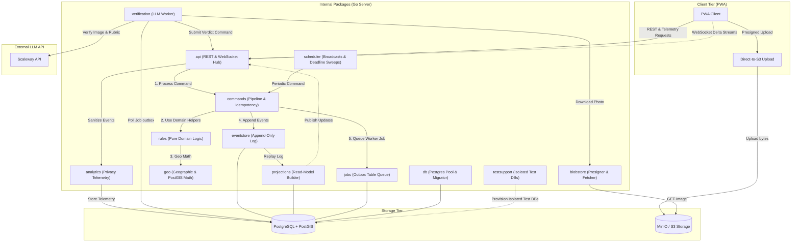

# Runway Internal Implementation Packages

The `/internal` directory contains the core server-side packages that run Runway's location-based game engine. In accordance with Go package visibility rules, packages placed inside the `internal/` directory can only be imported by packages in the same module subtree (i.e., under the `github.com/Jessevdz/RunwayTheGame` module). This enforces a strict modular boundary, preventing external consumers from depending on private implementation details.

---

## Architecture & Data Flow Overview

Runway utilizes an **Event Sourcing** architecture to implement a narrow write path and a wide, disposable read path. 

1. **Commands (Writes)**: Mutating requests (e.g., waypoint captures, challenge submissions, and power-up purchases) are processed through the command pipeline (`internal/commands`). This pipeline performs idempotency checks, transaction management, and optimistic concurrency verification before committing state.
2. **Events (State Changes)**: A successful command appends one or more events to the `internal/eventstore` database table within a serializable database transaction. The event log represents the single append-only source of truth.
3. **Projections (Reads)**: Read models are generated dynamically via event folding (`internal/projections`). When the event stream changes, the projection engine rebuilds or incrementally updates team progress, waypoint and road state, balances, standings, and active effects, then broadcasts updates to client PWAs over WebSockets (`internal/api`).
4. **Asynchronous LLM Verification**: Photo verification is processed out-of-band by a pool of stateless workers (`internal/verification`). These workers poll a Postgres outbox queue (`internal/jobs`), download submissions directly from object storage (`internal/blobstore`), run GPS/velocity heuristics, invoke Scaleway Multimodal Generative LLM APIs for rubric evaluation, and submit verdict commands back into the REST API.
5. **Closed-Vocabulary Telemetry**: Application usage and interaction events are validated and sanitized via a strict closed vocabulary (`internal/analytics`) before persistence, ensuring zero free-form strings or PII are stored.

---

## Package Directory Tour

The `/internal` directory contains the following packages:

| Package | Purpose & Primary Responsibilities | Key Files / Entry Points |
| :--- | :--- | :--- |
| **[`analytics`](analytics)** | Defines a closed-vocabulary schema, sanitizes event properties against PII/free-form strings, and buckets numeric attributes for privacy-preserving telemetry. | [`analytics.go`](analytics/analytics.go), [`buckets.go`](analytics/buckets.go), [`registry.go`](analytics/registry.go) |
| **[`api`](api)** | Exposes REST HTTP endpoints and maintains the realtime WebSocket hub to broadcast projection updates to active games. Handles authentication (capability tokens, admin sessions), rate limiting, real IP resolution, game lifecycle, boards, roadmaps, retention, and analytics ingestion. | [`api.go`](api/api.go), [`adminsession.go`](api/adminsession.go), [`auth.go`](api/auth.go), [`boards.go`](api/boards.go), [`challenges.go`](api/challenges.go), [`games.go`](api/games.go), [`realtime.go`](api/realtime.go), [`ratelimit.go`](api/ratelimit.go), [`realip.go`](api/realip.go), [`retention.go`](api/retention.go), [`report.go`](api/report.go), [`roadmap.go`](api/roadmap.go) (+ `game_*.go` & `board_*.go` handlers) |
| **[`blobstore`](blobstore)** | Mints short-lived, presigned PUT upload URLs using AWS SigV4 query signing (built on standard Go libraries to run SDK-free), enforces SSRF key validation, and manages photo downloads/deletions with MinIO/S3. | [`blobstore.go`](blobstore/blobstore.go), [`presign.go`](blobstore/presign.go) |
| **[`commands`](commands)** | Orchestrates command execution in serializable database transactions via `CommandProcessor`, checking request idempotency, executing outbox job hooks, and triggering realtime broadcast hooks. | [`commands.go`](commands/commands.go) |
| **[`config`](config)** | Centralized environment variable resolution with typed fallbacks (`EnvOr`, `EnvIntOr`). | [`env.go`](config/env.go) |
| **[`db`](db)** | Wraps the `pgxpool.Pool` connection pool and implements automated Postgres database schema migrations utilizing embedded SQL (`//go:embed`). | [`db.go`](db/db.go), [`schema.sql`](db/schema.sql) |
| **[`eventstore`](eventstore)** | Provides sequential event insertion with optimistic concurrency checks (`sequence` mismatch protection) and event stream retrieval. | [`events.go`](eventstore/events.go), [`types.go`](eventstore/types.go) |
| **[`geo`](geo)** | Computes geodesic and haversine distances, publishes board snapshots, and validates board geometry and connectivity. | [`geo.go`](geo/geo.go), [`publish.go`](geo/publish.go), [`validation.go`](geo/validation.go) |
| **[`jobs`](jobs)** | Defines Postgres-backed outbox queue entries and scheduler helpers for background tasks (e.g., photo verification jobs). | [`jobs.go`](jobs/jobs.go) |
| **[`logger`](logger)** | Implements structured JSON logging with support for context-propagated trace IDs (`X-Trace-ID`). | [`logger.go`](logger/logger.go) |
| **[`projections`](projections)** | Computes in-memory read models (`GameStateProjection`) by replaying the event stream for a specific game sequence, enforcing tracker-off position privacy filters. | [`rebuild.go`](projections/rebuild.go), [`derive.go`](projections/derive.go), [`state.go`](projections/state.go), [`board.go`](projections/board.go) + `fold_*.go` |
| **[`rules`](rules)** | Provides pure domain helpers for road traversal and waypoint state, challenge outcomes and veto timing, shortest remaining route estimates, power-up and effect checks, ruleset normalization, Coin Rush rankings, and GPS arrival and speed validation. | [`engine.go`](rules/engine.go), [`types.go`](rules/types.go), [`gps.go`](rules/gps.go) |
| **[`scheduler`](scheduler)** | Periodically broadcasts live game projections and ends games whose countdowns or deadlines have lapsed. | [`scheduler.go`](scheduler/scheduler.go) |
| **[`testsupport`](testsupport)** | Provides isolated per-package test database provisioning (`runway_test_<pkg>`), fixture setup, and cleanup utilities for parallel integration testing. | [`testsupport.go`](testsupport/testsupport.go) |
| **[`verification`](verification)** | Orchestrates asynchronous rubric validation, including EXIF and GPS-velocity heuristics, Scaleway/Gemini API calls, auto-escalation, and verdict submission. | [`worker.go`](verification/worker.go), [`scaleway.go`](verification/scaleway.go), [`heuristics.go`](verification/heuristics.go), [`types.go`](verification/types.go) |

---

## Component Interaction & Data Flow

The diagram below details the components' interactions and dependencies:



---

## Design Principles & Patterns

1. **Pure Domain Helpers**:
   Functions in `internal/rules` take explicit game values and return decisions or calculations. They do not perform file I/O, database queries, or read the clock; callers supply time-dependent inputs. The package provides reusable game-rule calculations rather than a single command-to-events state machine.

2. **Command/Event Separation**:
   Mutating actions are recorded as events through the command pipeline, and projections derive read state from those events. API handlers use the relevant domain helpers while validating and applying each action before appending its events.

3. **Direct-to-Object-Storage Uploads**:
   Heavy assets (like photographic evidence) do not transit the game server. The client requests a presigned URL via the REST API (generated by `internal/blobstore`), uploads the image directly to MinIO/S3, and sends only the metadata and a `blob_ref` to the API.

4. **Self-Contained SQL Migration (Embedded)**:
   The `internal/db` package embeds the database schema using Go's `//go:embed` directive and automatically performs migrations on pool initialization.

5. **Closed-Vocabulary Privacy & Telemetry (`internal/analytics`)**:
   All recorded telemetry must be processed through `internal/analytics`, which strictly prohibits free-form string properties, enforces an allowlist of event names and enum properties, and automatically buckets numeric values to guarantee zero PII or free text storage.

6. **Defense in Depth & Security Controls**:
   - **Capability Token Auth**: Host capability tokens are hashed at rest (`api/auth.go`), while join tokens are validated via capability checks.
   - **SSRF Hardening**: Object keys in `internal/blobstore` are strictly validated before issuance or retrieval.
   - **Real-IP & Rate Limiting**: Request origins are resolved via `internal/api/realip.go` and rate-limited via `internal/api/ratelimit.go`.
   - **Automated Retention**: Retention sweeps (`internal/api/retention.go`) clean up old data, deleting blob storage objects before database row removal.

---

## Testing Guidelines

Each package houses corresponding Go tests (e.g., `engine_test.go`, `projections_test.go`, `analytics_test.go`).
- Run all tests within the internal folder using:
  ```bash
  go test -v ./internal/...
  ```
- Automated database test isolation is managed via `internal/testsupport`, which provisions isolated test databases (`runway_test_<pkg>`) to ensure clean state and avoid lock contention during parallel package runs.
- Pure calculations in `internal/rules`, such as road gating, route estimates, Coin Rush ranking, and GPS arrival checks, can be verified without an external database. Integration behavior involving event folding or database persistence belongs in the corresponding projection or API tests.


